# 智能制造移动看板系统 (Smart-Manufacture-APP)

本项目为智能工业物联网系统的移动端监控客户端（Android 原生应用）。系统基于前后端分离架构开发，通过对接后端服务生态，将传统工业车间的设备状态、生产任务及异常数据延伸至移动终端，实现车间现场数据的实时看板化、任务流转数字化与异常响应的高效化。

### 1、**情景（Situation）：**

- 现有的系统前端是网页端，只适配了电脑端。但是考虑到实际生产环境当中，不可能随时随地查看电脑。系统如果有报警信息或者出现异常急需人工处理，电脑端无法及时通知相关人员，最终可能造成巨大的损失。
- 如果实际生产当中遇到了各种异常的情况，需要拍照上传到系统当中，只靠网页端无法很便捷地上传异常图片，导致异常处理不及时，最终也可能造成巨大的损失。
- 需要拓展系统在手机端上的展示。我有过APP和微信小程序的开发经历，所以在APP和微信小程序当中考虑。但是考虑到需要调用手机相机和通知等权限，APP对这些权限的调用更方便；而且微信小程序想要其他人使用需要花300的小程序上架手续费。综合考虑，最终采纳了在APP端实现。
- 而且由于之前开发这个系统后端的同学已经离开实验室，没有人给我提供项目后端接口文档，需要我自己查看后端代码，通过postman软件一个接口一个接口地进行尝试连接。

### 2、**任务（Task）：**

- 先实现APP前端系统最基础的功能，比如登录，访问后端接口获取数据库内容等基础功能。
- 再充分发挥APP端的独特优势，调用手机各个权限，比如相机和通知权限，实现异常及时拍照上传和报警及时通知的功能。

### 3、**行动（Action）：**

- **第一阶段：逆向解析接口与底层网络架构搭建（克服无文档困难）**

  - 在前人离职且无接口文档的“盲人摸象”状态下，我通过阅读遗留的后端源码，结合 Postman 工具逐一测试、抓包和逆向推导，梳理出了所有需要的核心 API 规范。

  - 随后在 Android 端，我引入了 Retrofit + OkHttp 搭建底层网络通信层，并配合 Gson 编写了严格的响应实体类（Response）进行 JSON 反序列化。为了应对实验室服务器 IP 频繁变动的问题，我在登录模块实现了动态 IP 输入与本地持久化存储机制。

- **第二阶段：核心业务看板落地与状态管理（APP V1.0）**

  - **登录与权限流转：** 实现了基于 Token 的身份认证机制，完成 Token 缓存、半小时定期刷新以及“记住密码”的自动登录功能。

  - **业务数据展示：** 采用原生 Material Design 规范，搭建了侧边抽屉导航（DrawerLayout）结合 TabLayout 的多模块架构。编写了多个自定义适配器（如 `TaskAdapter`、`AlertAdapter`），结合 `RecyclerView` 将获取到的生产计划、订单需求、报警信息等复杂数据结构化、列表化地展示在移动端。

- **第三阶段：发挥移动端原生优势，补齐硬件与通知短板（APP V1.5 - V2.0）**

  - **异常拍照与文件流传：** 针对现场异常上报的需求，我配置了 `FileProvider` 适配 Android 文件访问权限，成功调用系统相机/相册。利用 Retrofit 的 `Multipart` 表单上传技术，实现了“图片+文字描述”的高效并发上传。

  - **后台报警通知：** 引入了 Android Jetpack 的 WorkManager 组件（`AlertCheckWorker`），实现应用在后台时的定时轮询。一旦接口检测到新报警，立刻调用系统 Notification 权限在手机通知栏弹出警告，解决了 PC 网页端“人不在电脑前就无法获知异常”的致命痛点。

  - **集成扫码交互：** 基于 ZXing 库定制了竖屏扫码界面（`QrScannerActivity`），添加了扫描线动画，跑通了移动端扫码确认、PC端同步登录的接口交互逻辑。

- **第四阶段：前端路由改造与双后端架构解耦（系统级性能优化）**

  - **发现痛点：** 随着异常记录（特别是图片）增多，原有 Java + MySQL 的单体架构会导致 B+ 树索引臃肿，查询性能断崖式下降。

  - **架构解耦：** 我果断将“多媒体异常记录”业务从主系统中剥离，独立开发了一个基于 Python 的轻量级微服务后端（采用物理文件目录 + `json` 映射记录图文关系）。

  - **移动端多路分发：** 配合后端的重构，我在 APP 端（`ApiClient`、`Routes`）实现了多基地址（Multi-BaseUrl）分发路由机制。APP 登录时提供主系统和异常系统两个 IP 输入框，底层网络请求自动根据业务分类（常规业务走 Java 接口，图片上传走 Python 接口）进行精准路由转发。这不仅大幅提升了拉取速度，还为未来无缝接入 AI 工业视觉检测预留了极佳的生态位。

### 4、**结果（Result）：**

- **基础业务全面移动化：** 成功从零到一构建了移动端原生 APP，完成了包含动态 IP 配置 、基于 Token 自动刷新及“记住密码”的安全登录体系 。将传统车间只能在 PC 查阅的生产计划、订单需求、任务进度和个人信息等数据，完美延伸至移动端展示 ，实现了车间数据的实时看板化。  

- **彻底消除异常响应盲区：** 依托 Android 系统的 WorkManager 后台任务组件，成功实现了 V1.5 版本的后台报警轮询机制 。一旦生产线出现异常，系统会立即在手机通知栏弹出警告 ，彻底打破了传统 PC 网页端“工作人员离开电脑就无法获知异常”的致命局限，极大提升了车间的异常响应效率。  

- **打通现场多媒体上报闭环：** 充分发挥了移动端的原生硬件优势，在 V2.0 版本跑通了调用相机/相册进行“图片+文字描述”的表单上传流程 。现场操作人员遇到设备故障即可直接拍照取证并一键上报，解决了过去纯网页端难以便捷采集现场图像证据的痛点。  

- **实现高可用双栈解耦架构：** 成功重构了 APP 底层的多基地址（Multi-BaseUrl）分发路由机制。通过在登录页配置主系统和异常系统双 IP 输入框 ，将常规业务与耗时的多媒体上传业务精准分流至 Java 和 Python 双后端微服务。这一改造彻底解决了单体 MySQL 数据库存储海量图片导致索引臃肿的问题，大幅提升了列表数据的拉取速度，并为后续无缝接入工业 AI 视觉检测模块做好了前瞻性的架构预留。  

### 5、**复盘（Evaluation）：**

- **架构演进与解耦思维落地：** 在项目初期，我曾试图将新增的多媒体上传功能直接硬编码到原有的 Java 主系统中。但随着业务复杂度的提升，单体架构的性能瓶颈与代码耦合问题迅速暴露。果断将异常记录拆分为独立的 Python 微服务，让我深刻体会到了“微服务架构”与“业务解耦”在实际工程中的巨大价值。这种读写分离、多基地址路由的设计，不仅彻底解决了性能危机，也大幅降低了后期的维护成本。

- **原生端侧能力的价值重塑：** 过去的项目多局限于 Web 端前后端开发，而该项目让我真正认识到了移动原生特性（系统级大喇叭通知、底层硬件级相机调用、WorkManager 后台保活等）在工业物联网场景下不可替代的优势。通过本项目，我熟练掌握了现代化的 Android 开发技术栈，拓宽了自身的全栈技术广度。

- **不足与未来演进规划：**

  - **异常处理缺乏智能化：** 目前的异常记录模块仅实现了基础的“上报-展示”闭环。后续计划将其接入 AI 知识库，当现场人员上传异常后，系统能自动根据知识库历史数据返回初步的分析结果与排障建议 。  

  - **缺乏实时监控手段：** 现阶段仍需依赖工人主动上报异常。未来计划在 APP 内集成流媒体拉流技术，直接调用并接入车间现场的摄像头，实现对生产状况的实时远程查勘 。  

  - **视觉检测预留：** 当前独立的 Python 后端仅作为纯粹的图文物理存储节点，未来可以无缝集成 OpenCV 等计算机视觉库。在不改动前端移动端代码的前提下，直接在后端对上传的异常图片进行特征提取与缺陷识别，完成车间巡检的智能化升级。

### 6、附加说明（addition）：

**（1）基础导航与入口**

<table>
  <tr>
    <td align="center">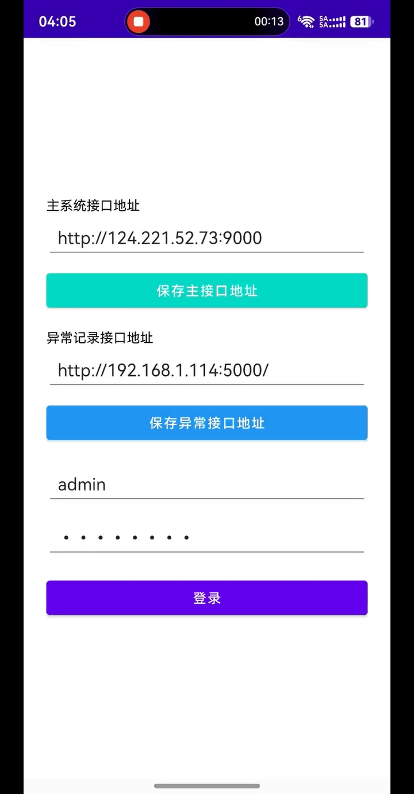 登录页面</td>
    <td align="center">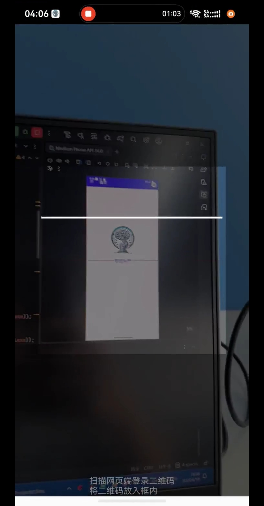 扫码登录</td>
    <td align="center">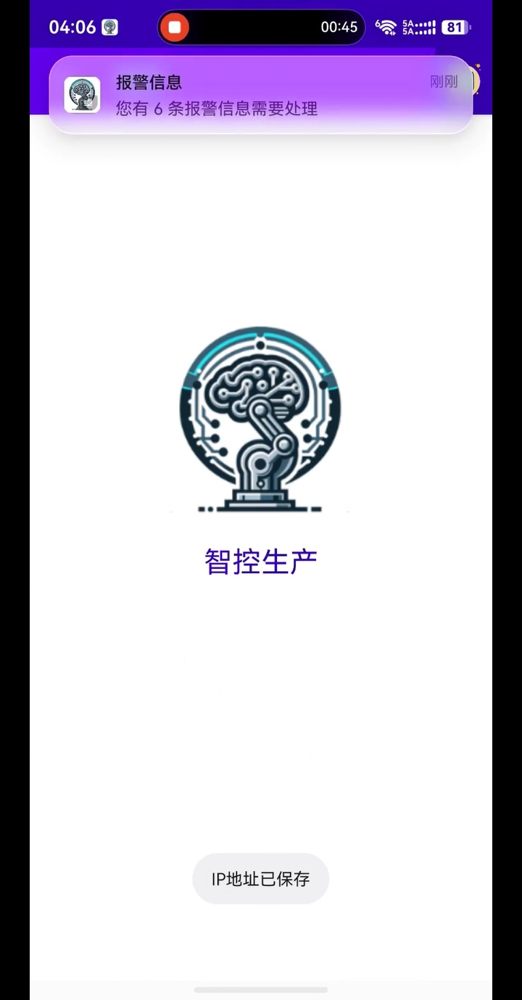 APP首页</td>
    <td align="center">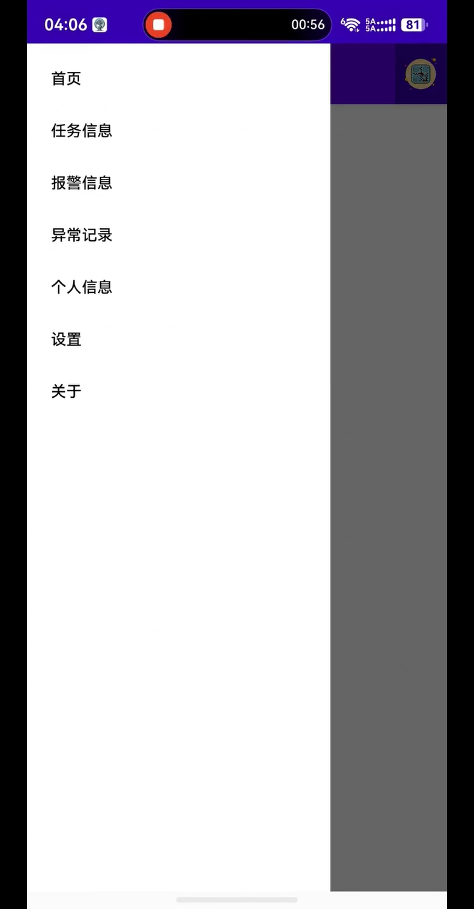 侧边导航栏</td>
  </tr>
</table>

**（2）生产任务看板（多标签与滚动列表）**

<table>
  <tr>
    <td align="center">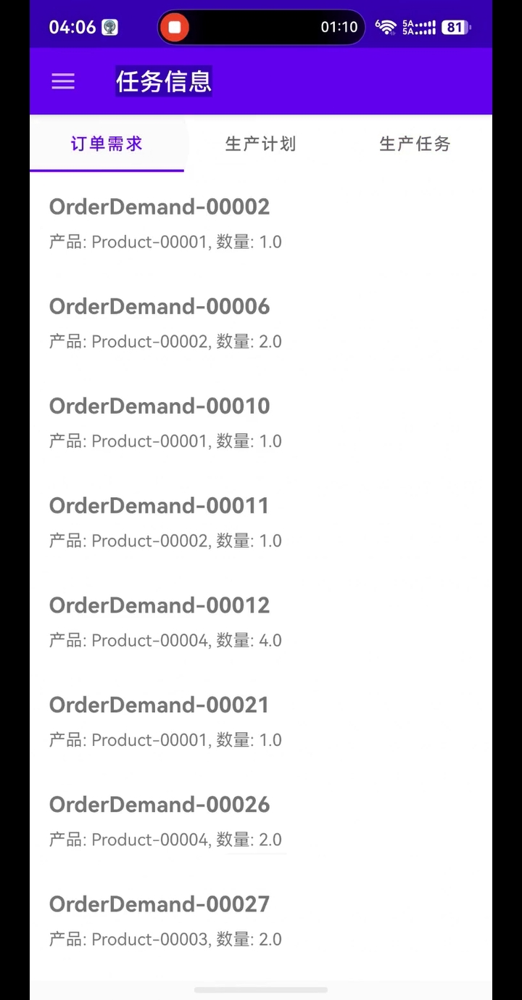 订单需求</td>
    <td align="center">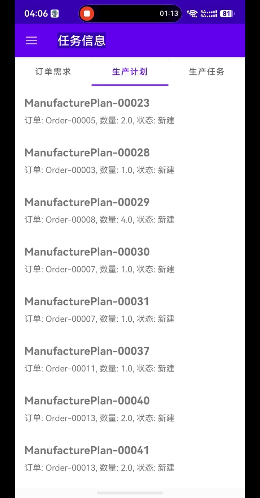 生产计划</td>
    <td align="center">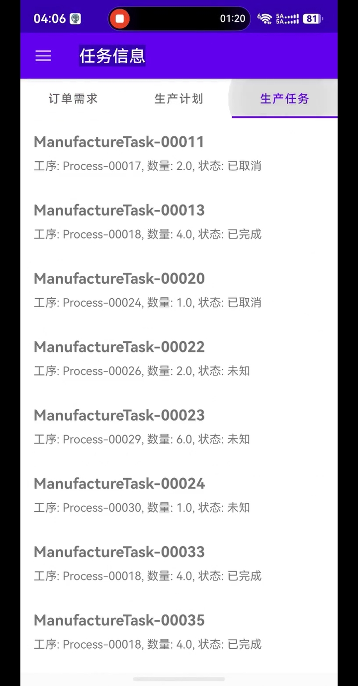 生产任务</td>
  </tr>
</table>

**（3）异常监控与处理业务闭环**

<table>
  <tr>
    <td align="center">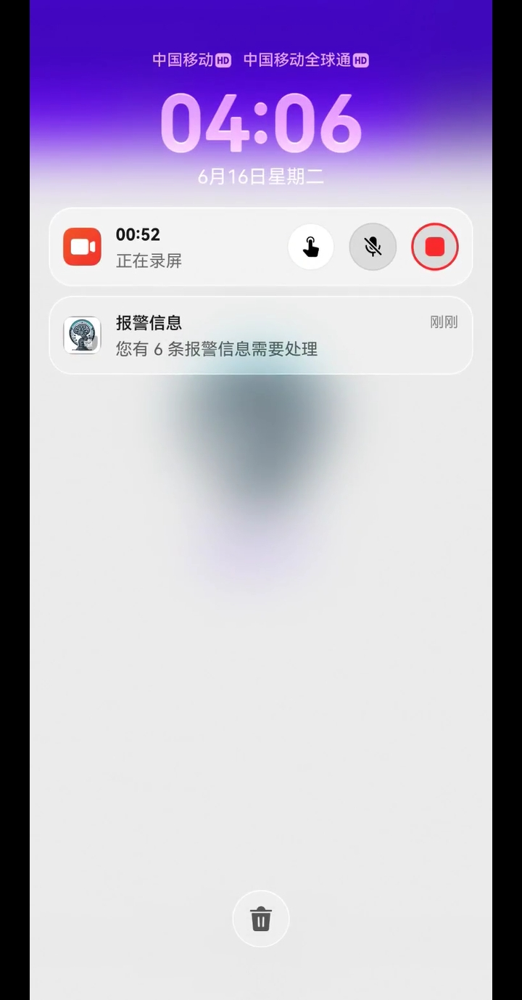 后台报警通知</td>
    <td align="center">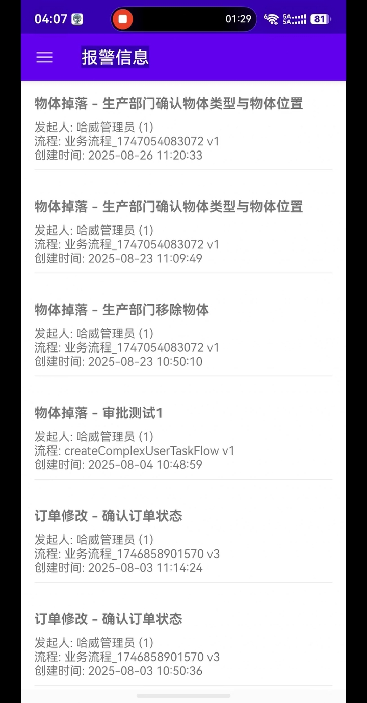 报警列表</td>
    <td align="center">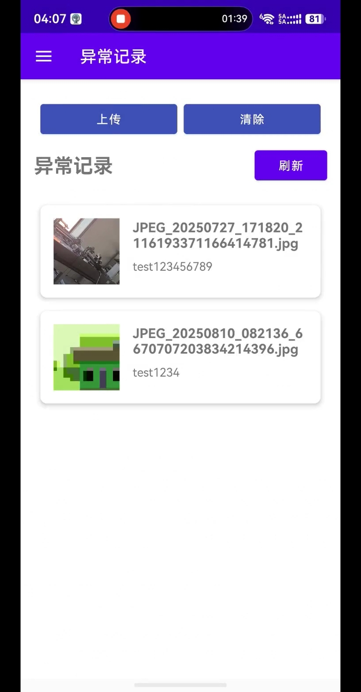 异常上传与记录</td>
    <td align="center">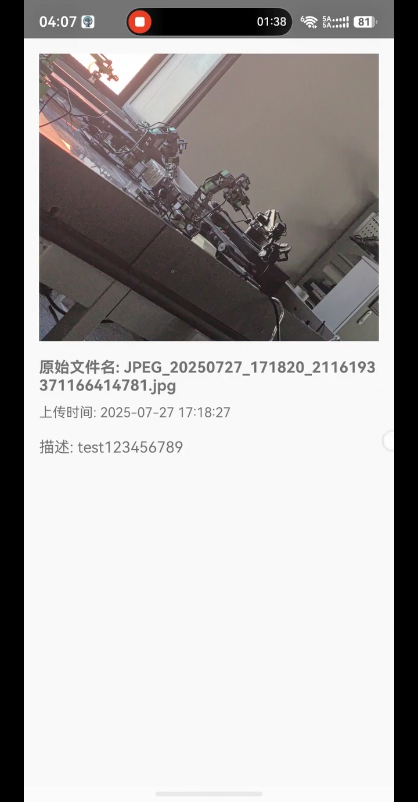 异常详情展示</td>
  </tr>
</table>

**（4）个人信息与系统设置**

<table>
  <tr>
    <td align="center">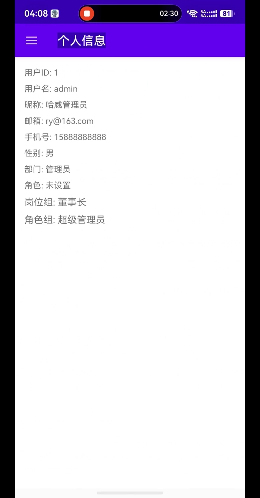 个人信息</td>
    <td align="center">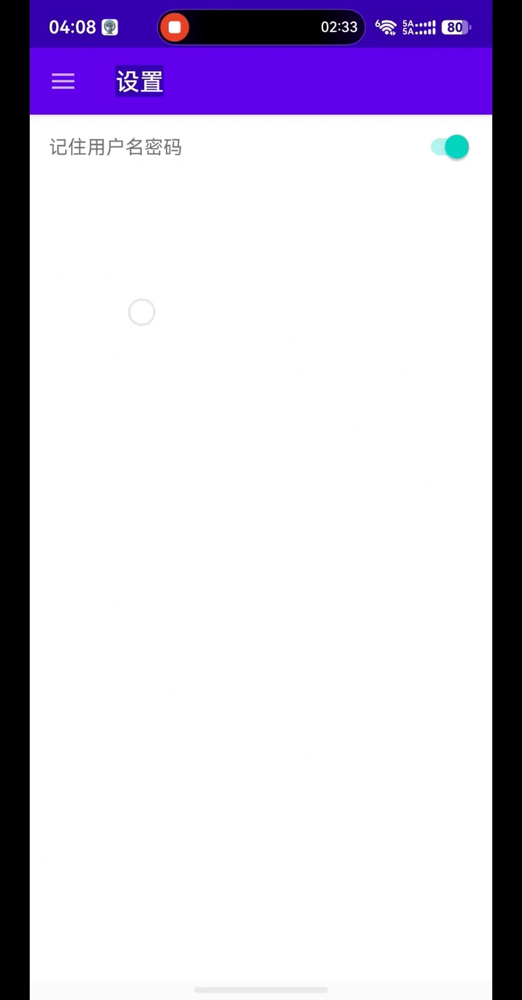 系统设置</td>
    <td align="center">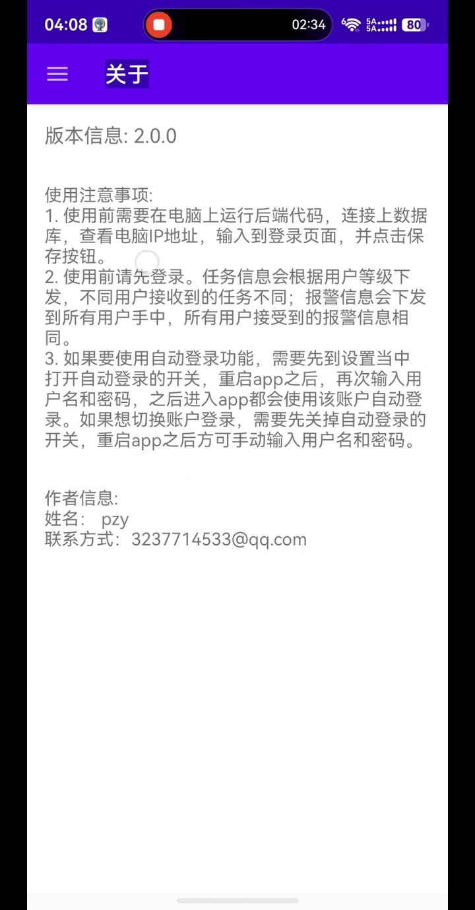 关于应用</td>
  </tr>
</table>
